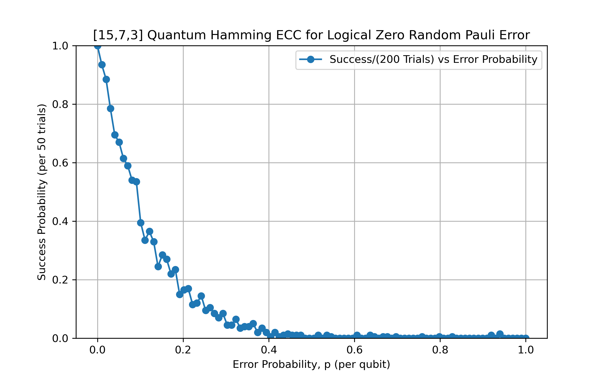

# 🧩 CSS Quantum Hamming Code [[15,7,3]] Error Correction in Qiskit

This code demonstrates and implements the quantum Hamming CSS ECC [[15,7,3]]. Random Pauli errors are applied to each qubit with a given probability and the corresponding corrections are performed.

- **Circuit features**:
  - Logical state preparation  
  - Pauli noise channel  
  - Syndrome extraction  
  - Recovery operation
---

## Overview

The code provides quantum circuit constructions for:

- (1,2) **Logical zero state derivation and preparation** of the [[15,7,3]] CSS code  
- (3) **Random Pauli error circuit** that applys a uniformly random Pauli error to a single qubit
- (4)/(5) **Syndrome extraction circuits** for X and Z stabilizers  
- (6) **Correction operations** based on measured syndromes  
- (7) **Success probability calculation** across various error probabilities

---

## Results

- **Code**: [[15,7,3]] CSS Hamming code  
- **Trials per p-value**: 200  
- **Total sampled p-values**: 100 (uniform between 0 and 1)
- 

---

## Usage Instructions

1. **Run the package imports.**

2. **Initialize parity matrices and logical zero state.**  
   - Run the first cell to generate the parity check matrix, its RREF form (with column swaps), and the logical \(|0_L\rangle\) components.

3. **Run the random Pauli error cell.**  
   - Applies a uniformly chosen random Pauli operator to each qubit with probability \( p \).

4. **Run the extract_Xsyndromes cell.**  
   - Applies CX gates from data qubits to X-ancillas based on the parity check matrix.  
   - *(Optional)* Uncomment example usage to view the circuit.

5. **Run the extract_Zsyndromes cell.**  
   - Applies CX gates from Z-ancillas to data qubits based on the parity check matrix.  
   - *(Optional)* Uncomment example usage to view the circuit.

6. **Run the Quantum_Hamming_Circuit cell.**  
   - Prepares the logical zero state, applies errors, extracts syndromes, and performs corrections.  
   - *(Optional)* Uncomment example usage to view the circuit for a chosen p-value (e.g. \( p = 0.2 \)).
   - requires (2), (3), (4), (5)

7. **Run the success_probabilities cell.**  
   - Calculates and plots success probabilities for various values of \( p \).  
   - Default: `total_trials = 20`, `p_values = [0, 0.04, 0.08, 0.12, 0.16]`.  
   - Prints each (error probability, success probability) pair during simulation.  
   - Produces a final plot showing success/(20 trials) vs error probability.
   - requires (6)

---

## References

- Nielsen, Michael A., and Isaac L. Chuang. *Quantum Computation and Quantum Information*. 10th Anniversary ed., Cambridge University Press, 2010.
- Gottesman, Daniel. *Stabilizer Codes and Quantum Error Correction*. Ph.D. thesis, California Institute of Technology, 1997.  
  [https://arxiv.org/pdf/quant-ph/9705052](https://arxiv.org/pdf/quant-ph/9705052)
